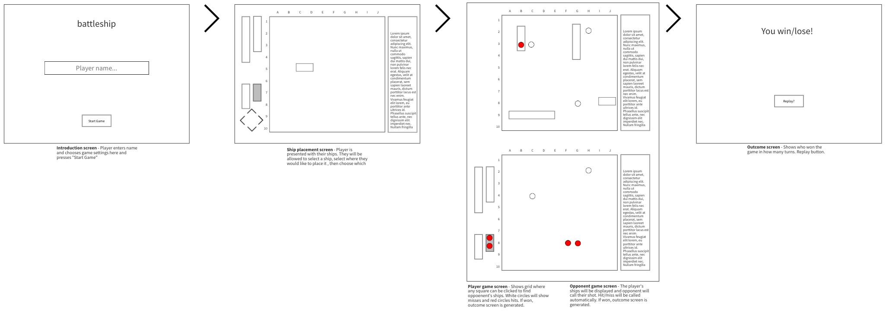

# battleship

Deployed at https://wonaval.github.io/battleship/

## Overview:
My project will be the board game Battleship. I chose this project so I can work more on grid CSS, generate simple CPU AI, and A LOT of DOM minipulation.

## Game Rules:

The player starts on a 10x10 grid and places 4 ships on the Ocean Grid by selecting the starting square on the grid then selecting a cardinal direction. The computer randomly selects placement of its ships. The player goes first and guesses a square on the target grid. If the computer has a ship there, a hit will be confirmed. If not, a miss is registered. The player and computer take turns until either the player or computer does not have any ships left and the outcome screen shows the winner.

## Wireframes:

## User stories:
When the page loads a 10x10 grid will show
When I click on one of the ships, I will able to click on the grid and a direction to place down each ship
One all ships are placed, I should be able to click on another grid to make guesses and be shown another grid for the computer's guesses.
When either I or the computer reaches zero ships left, the outcome screen is shown.

## MVP Checklist:
- [x] Enter player name
- [x] Generate 10x10 board
- [x] Placement of ships
- [x] Grid is clickable and confirms hit/miss
- [x] Win condition when one player has no ships left

## Stretch Goals:
- [ ] Allow 2nd player
- [ ] Allow n-shots to be taken per turn

## Summary:
The game is coded with HTML, CSS, and JavaScript. The code is fairly straight forward. I wish I thought to use classes earlier in the project but I wasn't able to find time to refactor my code to accomodate it. The most interesting code to write was the square validation functions that helped determine whether you can place a ship on a certain space in a certain direction. MDN and W3Schools were a HUGE help in finding correct syntax.
