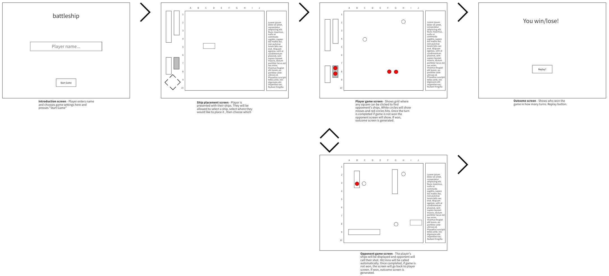

# battleship

## Overview:
My project will the board game Battleship. I chose this project so I can work more on grid CSS, generate simple CPU AI, and A LOT of DOM minipulation.

## Game Rules:

The game board consists of a 10 x 10 grid. Each player has 4 number of ships of varying length. They may place their ships any where on the grid in either a vertical or horizontal oritentation.

The first player will start by picking a square on the gird not previously chosen and call out their selection. The other player will confirm whether or not square contains a part of their placed ships which will be displayed with a white circle (miss) or a red circle (hit).

Each player will take turns and the player who manages to guess the placement of all of the other player's ships is the winner. The loser takes a shot.

## Wireframes:

## User stories:
When the page loads a 10x10 grid will show
When I click on one of the ships, I will able to click on the grid and a direction to place down each ship

## MVP Checklist:
- [ ] Enter player name
- [ ] Generate 10x10 board
- [ ] Placement of ships
- [ ] Grid is clickable and confirms hit/miss
- [ ] Win condition when one player has no ships left

## Stretch Goals:
- [ ] Allow 2nd player
- [ ] Allow n-shots to be taken per turn